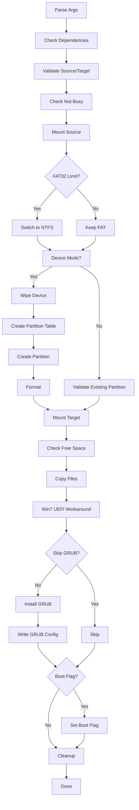

# Design: CLI Rewrite (Go)

## Context

The original WoeUSB-ng is a Python application that creates bootable Windows USB drives. It depends on Python 3, termcolor, and wxPython (for GUI). The codebase uses global mutable state, integer return codes, and subprocess calls for all disk operations.

This design describes a Go rewrite that produces a single static binary with improved error handling and no runtime dependencies beyond standard Linux system tools.

## Target Architecture

```
woeusb-go/
├── cmd/
│   └── woeusb/
│       └── main.go              # CLI entry point, argument parsing
├── internal/
│   ├── device/
│   │   ├── list.go              # USB/DVD enumeration
│   │   └── validate.go          # Source/target validation
│   ├── partition/
│   │   ├── wipe.go              # wipefs wrapper
│   │   ├── table.go             # parted mklabel/mkpart
│   │   └── format.go            # mkdosfs/mkntfs wrappers
│   ├── filesystem/
│   │   ├── mount.go             # mount/umount operations
│   │   └── copy.go              # file copying with progress
│   ├── bootloader/
│   │   ├── grub.go              # grub-install wrapper
│   │   └── uefi.go              # Win7 workaround, UEFI:NTFS
│   └── session/
│       └── session.go           # Session struct, cleanup logic
├── go.mod
└── go.sum
```

## Components

### cmd/woeusb (main.go)
- Parse CLI arguments using stdlib `flag`
- Create `Session` struct
- Call orchestration logic
- Handle signals (SIGINT/SIGTERM) for cleanup

### internal/session
- `Session` struct holds all state: source, target, mountpoints, temp dirs, options
- `Cleanup()` method handles unmount and temp dir removal
- Replaces global state from Python version

### internal/device
- `ListUSBDrives()` — parse `/sys/block/` or `lsblk --json`
- `ValidateSource(path)` — check file/block device exists
- `ValidateTarget(path, mode)` — check block device, device vs partition
- `CheckNotBusy(path)` — verify not mounted

### internal/partition
- `Wipe(device)` — run `wipefs --all`, verify success
- `CreateMBRTable(device)` — run `parted mklabel msdos`
- `CreatePartition(device, fstype, start, end)` — run `parted mkpart`
- `Format(partition, fstype, label)` — run `mkdosfs` or `mkntfs`
- `SetBootFlag(device, partNum)` — run `parted set N boot on`
- `RereadPartitionTable(device)` — run `blockdev --rereadpt`

### internal/filesystem
- `Mount(source, mountpoint, opts)` — use `syscall.Mount` or shell out
- `Unmount(mountpoint)` — use `syscall.Unmount` or shell out
- `CopyWithProgress(src, dst, progressFn)` — walk source, copy files, call progressFn
- `CheckFAT32Limit(mountpoint)` — walk and check file sizes >4GB
- `GetFreeSpace(mountpoint)` — use `syscall.Statfs`

### internal/bootloader
- `InstallGRUB(mountpoint, device)` — run `grub-install --target=i386-pc`
- `WriteGRUBConfig(mountpoint, grubPrefix)` — write `ntldr /bootmgr; boot`
- `ApplyWin7UEFIWorkaround(srcMount, dstMount)` — detect Win7, extract bootmgfw.efi via 7z
- `InstallUEFINTFS(partition, tempDir)` — download and write uefi-ntfs.img

## Execution Flow



## Interfaces

### CLI Flags
```
woeusb [--device | --partition] [options] <source> <target>

Options:
  --device, -d              Wipe entire device
  --partition, -p           Use existing partition
  --target-filesystem, -fs  FAT or NTFS (default: FAT)
  --label, -l               Filesystem label (default: "Windows USB")
  --workaround-bios-boot-flag  Set boot flag
  --workaround-skip-grub    Skip GRUB installation
  --verbose, -v             Verbose output
  --no-color                Disable colored output
  --version, -V             Print version
  --help, -h                Print help
```

### Progress Callback
```go
type ProgressFunc func(current, total int64, currentFile string)
```

### Session Struct
```go
type Session struct {
    Source           string
    Target           string
    TargetDevice     string
    TargetPartition  string
    Mode             string // "device" or "partition"
    Filesystem       string // "FAT" or "NTFS"
    Label            string
    SourceMount      string
    TargetMount      string
    TempDir          string
    SkipGRUB         bool
    SetBootFlag      bool
    Verbose          bool
    NoColor          bool
}

func (s *Session) Cleanup() error
```

## Error Handling

- All functions return `error` (no integer codes)
- Wrap errors with context: `fmt.Errorf("failed to wipe device: %w", err)`
- `Session.Cleanup()` called via `defer` in main
- Signal handler (SIGINT/SIGTERM) triggers cleanup before exit

## Security Considerations

- Check `os.Getuid() == 0` at startup; warn if not root
- Validate target is a block device before any destructive operation
- Never operate on mounted filesystems without explicit unmount

## Observability

- Print colored status messages to stderr (green=info, yellow=warn, red=error)
- `--verbose` flag enables additional debug output
- `--no-color` disables ANSI color codes
- Progress output: `Copying: 1.2 GiB / 4.5 GiB (26%) - sources/install.wim`

## Assumptions / Open Questions

1. **UEFI:NTFS URL stability** — Currently hardcoded to Rufus GitHub repo; may need fallback or bundling
2. **NVMe device naming** — `/dev/nvme0n1p1` pattern differs from `/dev/sdX1`; validation logic must handle both
3. **grub-install vs grub2-install** — Need to detect which is available at runtime
