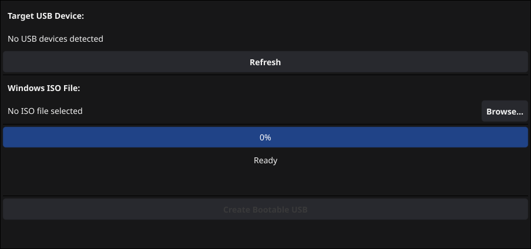

# WoeUSB-go



WoeUSB-go is a Go implementation of the popular WoeUSB tool. It allows you to create a bootable Windows USB drive from an ISO image or a physical DVD. It supports both Legacy BIOS and UEFI booting.

## Prerequisites

Before using WoeUSB-go, ensure you have the following system dependencies installed. You can verify this by running `woeusb-go --check-deps`.

### Required
- **util-linux** (`wipefs`, `lsblk`, `blockdev`, `mount`, `umount`)
- **parted**
- **7zip** (`7z`) - Package: `p7zip-full` or `p7zip`
- **dosfstools** (`mkdosfs`, `mkfs.vfat`)
- **wimlib** (`wimlib-imagex`) - Package: `wimlib` or `wimtools`

### Optional
- **grub2** (`grub-install`) - Required for Legacy BIOS boot support.
- **ntfs-3g** (`mkntfs`) - Required if you want to use NTFS as the target filesystem.

## Installation

### From Source

Ensure you have Go 1.21 or later installed.

```bash
git clone https://github.com/mathisen/woeusb-go.git
cd woeusb-go
go build -o woeusb-go ./cmd/woeusb
sudo mv woeusb-go /usr/local/bin/
```

## Usage

WoeUSB-go must be run with root privileges (using `sudo`) as it modifies device partitions and filesystems.

### GUI Mode

To launch the graphical user interface:

```bash
sudo woeusb-go --gui
```

### CLI Mode

#### Device Mode (Erase Entire USB)
This mode will wipe the entire USB drive and create a new partition table.

```bash
# Syntax: woeusb-go --device <source_iso> <target_device>
sudo woeusb-go --device windows_10.iso /dev/sdX
```

#### Partition Mode (Use Existing Partition)
This mode copies files to an existing partition. The partition will be formatted.

```bash
# Syntax: woeusb-go --partition <source_iso> <target_partition>
sudo woeusb-go --partition windows_10.iso /dev/sdX1
```

### Options

| Flag | Description | Default |
|------|-------------|---------|
| `--target-filesystem` | Target filesystem (`FAT` or `NTFS`). | `FAT` |
| `--label` | Label for the USB drive. | `Windows USB` |
| `--verbose`, `-v` | Enable verbose output for debugging. | `false` |
| `--workaround-bios-boot-flag` | Set the boot flag on the partition. Useful for some buggy BIOSes. | `false` |
| `--workaround-skip-grub` | Skip GRUB installation (UEFI only boot). | `false` |
| `--no-color` | Disable colored output. | `false` |
| `--check-deps` | Check required dependencies and exit. | `false` |
| `--version` | Print version information. | `false` |

## Examples

**Create a UEFI-bootable USB with FAT filesystem:**
```bash
sudo woeusb-go --device windows.iso /dev/sdb
```

**Create a USB with NTFS filesystem:**
```bash
sudo woeusb-go --device --target-filesystem NTFS windows.iso /dev/sdb
```

**Create a USB compatible with Legacy BIOS (requires GRUB):**
```bash
sudo woeusb-go --device --workaround-bios-boot-flag windows.iso /dev/sdb
```
*(Note: GRUB installation is attempted by default unless `--workaround-skip-grub` is used.)*

## License

This project is open source.
